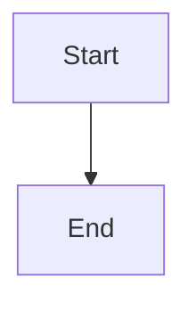

# Markdown WYSIWYG - Epic Breakdown

**Author:** Riccardo
**Date:** 2025-12-11
**Project Level:** Low Complexity
**Target Scale:** Personal Productivity Tool (VS Code Extension)

---

## Overview

This document provides the complete epic and story breakdown for Markdown WYSIWYG, decomposing the requirements from the [PRD](./prd.md) into implementable stories with technical context from the [Architecture](./architecture.md).

**Epics Summary:**
- **Epic 1:** Foundation & Extension Setup (4 stories) ✅
- **Epic 2:** Markdown Rendering & Basic Editing (6 stories) ✅
- **Epic 3:** Code Blocks & Syntax Highlighting (2 stories) ✅
- **Epic 4:** Formatting Toolbar & Polish (4 stories) ✅
- **Epic 5:** UI/UX Polish & Customization (6 stories) 🔄
- **Epic 6:** Table Support (3 stories) ✅
- **Epic 7:** Task Lists (2 stories) ✅
- **Epic 8:** Frontmatter Support (2 stories) ✅
- **Epic 9:** Editor Customization (4 stories) ✅
- **Epic 10:** Editor Lifecycle & Tab Management (3 stories) 📋

**Total: 10 Epics, 36 Stories covering 41 Functional Requirements**

---

## Functional Requirements Inventory

### File Operations (FR1-4)
| ID | Requirement | MVP |
|----|-------------|-----|
| FR1 | Open `.md` file in WYSIWYG via right-click context menu | ✅ |
| FR2 | Open `.md` file in WYSIWYG via command palette | ✅ |
| FR3 | Auto-sync edits to underlying markdown file | ✅ |
| FR4 | Save document with Cmd/Ctrl+S | ✅ |

### Document Rendering (FR5-12)
| ID | Requirement | MVP |
|----|-------------|-----|
| FR5 | Render headings H1-H6 as visually distinct styled text | ✅ |
| FR6 | Render bold text as visually bold | ✅ |
| FR7 | Render italic text as visually italic | ✅ |
| FR8 | Render unordered lists with bullet styling | ✅ |
| FR9 | Render ordered lists with number styling | ✅ |
| FR10 | Render links as clickable styled text | ✅ |
| FR11 | Render fenced code blocks with syntax highlighting | ✅ |
| FR12 | Detect code block language and apply appropriate highlighting | ✅ |

### Editing Capabilities (FR13-17)
| ID | Requirement | MVP |
|----|-------------|-----|
| FR13 | Click any text element to place cursor and edit | ✅ |
| FR14 | Select text for formatting operations | ✅ |
| FR15 | Create new lines and paragraphs | ✅ |
| FR16 | Delete text and elements | ✅ |
| FR17 | Undo/redo edits | ✅ |

### Toolbar & Formatting (FR18-24)
| ID | Requirement | MVP |
|----|-------------|-----|
| FR18 | Display persistent formatting toolbar | ✅ |
| FR19 | Apply bold formatting via toolbar | ✅ |
| FR20 | Apply italic formatting via toolbar | ✅ |
| FR21 | Apply heading levels via toolbar | ✅ |
| FR22 | Create lists via toolbar | ✅ |
| FR23 | Insert links via toolbar | ✅ |
| FR24 | Insert code blocks via toolbar | ✅ |

### Table Support (FR25-28)
| ID | Requirement | MVP |
|----|-------------|-----|
| FR25 | Render markdown tables with pipe-delimited format | ✅ |
| FR26 | Insert tables via toolbar with configurable rows/columns | ✅ |
| FR27 | Add rows below and columns to the right | ✅ |
| FR28 | Delete entire tables via toolbar | ✅ |

### Task Lists (FR29-30)
| ID | Requirement | MVP |
|----|-------------|-----|
| FR29 | Render task list items as interactive checkboxes | ✅ |
| FR30 | Toggle task list checkbox state by clicking | ✅ |

### YAML Frontmatter (FR31-32)
| ID | Requirement | MVP |
|----|-------------|-----|
| FR31 | Detect and extract YAML frontmatter | ✅ |
| FR32 | View and edit frontmatter in visual editor | ✅ |

### Editor Customization (FR33-38)
| ID | Requirement | MVP |
|----|-------------|-----|
| FR33 | Configure editor appearance via showCard setting | ✅ |
| FR34 | Configure content padding via contentPadding setting | ✅ |
| FR35 | Configure text size via textSize setting | ✅ |
| FR36 | Configure line height via lineHeight setting | ✅ |
| FR37 | Configure accent color theme via accentTheme setting | ✅ |
| FR38 | Disable accent color for bold text via setting | ✅ |

### Editor Lifecycle (FR39-41)
| ID | Requirement | MVP |
|----|-------------|-----|
| FR39 | Track open custom editors for lifecycle coordination | ✅ |
| FR40 | Synchronize tab closure between custom and text editors | ✅ |
| FR41 | Prevent auto-open loop when closing editors | ✅ |

**Total: 41 Functional Requirements**

---

## FR Coverage Map

| FR | Epic | Story | Description |
|----|------|-------|-------------|
| FR1 | 1 | 1.3 | Context menu "Open with Markdown WYSIWYG" |
| FR2 | 1 | 1.3 | Command palette integration |
| FR3 | 2 | 2.5 | Bidirectional sync with debounce |
| FR4 | 2 | 2.6 | Save triggers file write |
| FR5 | 2 | 2.2 | Heading rendering H1-H6 |
| FR6 | 2 | 2.2 | Bold text rendering |
| FR7 | 2 | 2.2 | Italic text rendering |
| FR8 | 2 | 2.2 | Unordered list rendering |
| FR9 | 2 | 2.2 | Ordered list rendering |
| FR10 | 2 | 2.2 | Link rendering |
| FR11 | 3 | 3.1 | Code block rendering |
| FR12 | 3 | 3.2 | Language detection & highlighting |
| FR13 | 2 | 2.3 | Click-to-edit |
| FR14 | 2 | 2.3 | Text selection |
| FR15 | 2 | 2.4 | New lines and paragraphs |
| FR16 | 2 | 2.4 | Delete text and elements |
| FR17 | 4 | 4.4 | Undo/redo |
| FR18 | 4 | 4.1 | Persistent toolbar |
| FR19 | 4 | 4.2 | Bold via toolbar |
| FR20 | 4 | 4.2 | Italic via toolbar |
| FR21 | 4 | 4.2 | Headings via toolbar |
| FR22 | 4 | 4.3 | Lists via toolbar |
| FR23 | 4 | 4.3 | Links via toolbar |
| FR24 | 4 | 4.3 | Code blocks via toolbar |

---

## Epic 1: Foundation & Extension Setup

**Goal:** Establish the technical foundation—project scaffold, build system, VS Code extension registration, and WebView infrastructure. After this epic, users can open `.md` files in the custom editor (WebView loads, even if content is placeholder).

**User Value:** Extension installs and activates. Opening a markdown file shows the custom editor WebView.

**PRD Coverage:** FR1, FR2 (partial—registration only, full UX in Epic 2)
**Architecture Sections:** Starter Template, Project Structure, Build Tooling

---

### Story 1.1: Project Scaffold & Build Configuration

As a developer,
I want the project scaffolded with proper build configuration,
So that I have a working foundation for extension development.

**Acceptance Criteria:**

**Given** I run the scaffold command
**When** the generator completes
**Then** the project structure matches Architecture section "Project Structure"

**And** `package.json` contains:
- TypeScript 5.x dependency
- esbuild for extension bundling
- Vite for WebView bundling
- React 18.x and ReactDOM dependencies
- TipTap core dependencies (@tiptap/react, @tiptap/pm, @tiptap/starter-kit)
- Tailwind CSS 3.x with typography plugin

**And** TypeScript configuration includes:
- `tsconfig.json` (base)
- `tsconfig.extension.json` (Node.js target for extension)
- `tsconfig.webview.json` (ESNext target for WebView)

**And** build scripts exist:
- `npm run dev:extension` — watch mode for extension
- `npm run dev:webview` — Vite dev server
- `npm run build` — production build
- `npm run package` — create VSIX

**And** `.vscode/launch.json` contains Extension Development Host debug configuration

**Prerequisites:** None (first story)

**Technical Notes:**
- Start with `npx --package yo --package generator-code -- yo code -t=ts --bundle=esbuild`
- Manually restructure to match Architecture directory layout
- Configure separate TypeScript configs per Architecture section
- Add Vite config for WebView with React plugin

---

### Story 1.2: CustomTextEditorProvider Registration

As a developer,
I want the extension to register a CustomTextEditorProvider,
So that VS Code recognizes our editor for markdown files.

**Acceptance Criteria:**

**Given** the extension is installed
**When** VS Code activates the extension
**Then** a CustomTextEditorProvider is registered for `.md` files

**And** `package.json` contains:
```json
"contributes": {
  "customEditors": [{
    "viewType": "markdownWysiwyg.editor",
    "displayName": "Markdown WYSIWYG",
    "selector": [{ "filenamePattern": "*.md" }],
    "priority": "option"
  }]
}
```

**And** `extension.ts` activates on `onCustomEditor:markdownWysiwyg.editor`

**And** `editorProvider.ts` implements `CustomTextEditorProvider` interface with:
- `resolveCustomTextEditor()` method that creates a WebView panel
- Document change listener setup (placeholder)
- WebView message handler setup (placeholder)

**Prerequisites:** Story 1.1

**Technical Notes:**
- Use `vscode.window.registerCustomEditorProvider()` in activation
- Set `supportsMultipleEditorsPerDocument: false` initially
- WebView options: `enableScripts: true`, `retainContextWhenHidden: true`
- Create OutputChannel for debug logging per Architecture error handling pattern

---

### Story 1.3: Context Menu & Command Palette Integration

As a user,
I want to open markdown files in WYSIWYG view via context menu or command palette,
So that I can choose when to use the visual editor.

**Acceptance Criteria:**

**Given** I have a `.md` file in the explorer
**When** I right-click the file
**Then** I see "Open with Markdown WYSIWYG" in the context menu

**And** selecting it opens the file in the custom editor WebView

**Given** I have a `.md` file open in the standard editor
**When** I open the command palette and type "Markdown WYSIWYG"
**Then** I see "Markdown WYSIWYG: Open in Visual Editor" command

**And** executing it opens the file in the custom editor

**And** `package.json` contains:
```json
"contributes": {
  "commands": [{
    "command": "markdownWysiwyg.openEditor",
    "title": "Open in Visual Editor",
    "category": "Markdown WYSIWYG"
  }],
  "menus": {
    "explorer/context": [{
      "command": "markdownWysiwyg.openEditor",
      "when": "resourceExtname == .md",
      "group": "navigation"
    }]
  }
}
```

**Prerequisites:** Story 1.2

**Technical Notes:**
- Command implementation uses `vscode.commands.executeCommand('vscode.openWith', uri, 'markdownWysiwyg.editor')`
- Follows FR1 (context menu) and FR2 (command palette)

---

### Story 1.4: WebView React Shell with Tailwind

As a developer,
I want the WebView to render a React application with Tailwind styling,
So that I have a working UI foundation for the editor.

**Acceptance Criteria:**

**Given** I open a `.md` file with the custom editor
**When** the WebView loads
**Then** I see a React application rendered in the WebView

**And** the application displays a placeholder message: "Markdown WYSIWYG Editor"

**And** Tailwind CSS is functional (test with utility classes)

**And** the WebView respects VS Code theme (light/dark) via CSS custom properties

**And** the WebView HTML includes:
- CSP (Content Security Policy) allowing scripts and styles
- Vite-generated bundle references
- Theme CSS variable mappings

**And** `src/webview/App.tsx` renders without errors

**And** `src/webview/hooks/useVSCodeApi.ts` provides typed access to `acquireVsCodeApi()`

**Prerequisites:** Story 1.2

**Technical Notes:**
- WebView HTML template in `editorProvider.ts` with Vite bundle paths
- CSS variables map VS Code theme tokens to Tailwind (Architecture Frontend section)
- `useVSCodeApi` hook wraps `acquireVsCodeApi()` with TypeScript types
- Tailwind config extends theme with VS Code color variables
- Test with both light and dark VS Code themes

---

## Epic 2: Markdown Rendering & Basic Editing

**Goal:** Implement the core WYSIWYG experience—render markdown content visually and enable basic editing with bidirectional sync. After this epic, users can read markdown in a beautiful, readable format AND edit it visually with changes saved to the file.

**User Value:** Open any markdown file, read it like Medium.com, click to edit, save changes. The core "aha moment" from the PRD user journeys.

**PRD Coverage:** FR3, FR4, FR5, FR6, FR7, FR8, FR9, FR10, FR13, FR14, FR15, FR16
**Architecture Sections:** TipTap Integration, Communication Patterns, Data Flow

---

### Story 2.1: TipTap Editor Integration

As a developer,
I want TipTap editor integrated into the WebView,
So that I have a rich text editing foundation.

**Acceptance Criteria:**

**Given** the WebView loads
**When** TipTap initializes
**Then** an editable content area is rendered

**And** `src/webview/components/Editor.tsx` wraps TipTap with:
- `useEditor` hook from `@tiptap/react`
- `StarterKit` extension for basic formatting
- `@tiptap/extension-link` for link support
- Placeholder extension showing "Start typing..." when empty

**And** the editor area uses Tailwind Typography plugin (`prose` class) for styling

**And** the editor is focusable and accepts keyboard input

**And** the editor fills available viewport height (minus toolbar space reserved)

**Prerequisites:** Story 1.4

**Technical Notes:**
- TipTap configuration in dedicated `useTipTapEditor.ts` hook
- StarterKit includes: Document, Paragraph, Text, Bold, Italic, Strike, Code, Heading, BulletList, OrderedList, ListItem, Blockquote, HorizontalRule, HardBreak, History
- Apply `prose prose-slate dark:prose-invert max-w-none` for Medium-like typography
- Editor container: `min-h-screen p-8` for comfortable reading margins

---

### Story 2.2: Markdown Content Rendering

As a user,
I want my markdown file to render as beautiful, readable content,
So that I can read documents comfortably without seeing raw syntax.

**Acceptance Criteria:**

**Given** I open a `.md` file containing various markdown elements
**When** the content loads in the editor
**Then** headings (H1-H6) render with visually distinct sizes and weights (FR5)

**And** bold text (`**text**`) renders as bold (FR6)

**And** italic text (`*text*`) renders as italic (FR7)

**And** unordered lists (`- item`) render with bullet points (FR8)

**And** ordered lists (`1. item`) render with sequential numbers (FR9)

**And** links (`[text](url)`) render as clickable, styled text (FR10)

**And** blockquotes render with left border styling

**And** horizontal rules render as visual dividers

**And** paragraphs have comfortable spacing

**And** content loads in < 500ms for files up to 10,000 lines (NFR1)

**Prerequisites:** Story 2.1

**Technical Notes:**
- Extension sends `{ type: 'init', content: markdownString }` message on open
- WebView receives message and calls `editor.commands.setContent(markdown)`
- TipTap's `@tiptap/pm/markdown` or custom markdown parsing needed
- If using StarterKit, need to parse markdown to ProseMirror doc structure
- Consider `remark-parse` → ProseMirror conversion or TipTap markdown extension
- Tailwind Typography plugin handles visual styling automatically
- Test with PRD document itself as real-world sample

---

### Story 2.3: Click-to-Edit & Text Selection

As a user,
I want to click anywhere in the document to edit,
So that I can make changes without switching modes.

**Acceptance Criteria:**

**Given** a rendered markdown document
**When** I click on any text element (heading, paragraph, list item, etc.)
**Then** the cursor is placed at the click position (FR13)

**And** I can immediately type to insert text

**And** I can double-click to select a word

**And** I can triple-click to select a paragraph

**And** I can click-and-drag to select arbitrary text ranges (FR14)

**And** selected text is visually highlighted with VS Code selection color

**And** typing latency is imperceptible (< 50ms input-to-render) (NFR2)

**Prerequisites:** Story 2.2

**Technical Notes:**
- TipTap handles cursor placement natively via ProseMirror
- Ensure editor is not set to `editable: false`
- Selection styling via `.ProseMirror-selectednode` and `::selection` CSS
- Map VS Code's `--vscode-editor-selectionBackground` to selection color
- Test rapid typing for latency compliance

---

### Story 2.4: Text Input & Deletion

As a user,
I want to create and delete content naturally,
So that editing feels like a standard text editor.

**Acceptance Criteria:**

**Given** the cursor is in the document
**When** I press Enter
**Then** a new line or paragraph is created appropriately (FR15)

**And** Enter at end of list item creates new list item

**And** Enter twice in list exits list and creates paragraph

**When** I press Backspace
**Then** text before cursor is deleted (FR16)

**And** Backspace at start of block merges with previous block

**And** Backspace on empty list item removes the item

**When** I press Delete
**Then** text after cursor is deleted

**And** I can delete selected text with Backspace or Delete

**And** I can select-all (Cmd/Ctrl+A) and delete to clear document

**Prerequisites:** Story 2.3

**Technical Notes:**
- TipTap/ProseMirror handles all these behaviors by default with StarterKit
- Verify list behavior matches user expectations
- Test edge cases: empty document, single character, cursor at boundaries

---

### Story 2.5: Bidirectional Sync (WebView ↔ Extension)

As a user,
I want my edits to sync to the markdown file automatically,
So that I don't lose work and the file stays current.

**Acceptance Criteria:**

**Given** I make an edit in the WYSIWYG editor
**When** I stop typing for 300ms
**Then** the change is synced to the underlying markdown file (FR3)

**And** the sync uses the message protocol from Architecture:
- WebView sends `{ type: 'contentChanged', markdown: string }`
- Extension receives and calls `document.edit()` to update TextDocument

**And** if the file is modified externally (e.g., git checkout)
**Then** the extension sends `{ type: 'externalChange', content: string }`

**And** the editor updates to reflect external changes without losing cursor position

**And** rapid typing doesn't cause excessive sync operations (debounce)

**And** markdown output preserves original formatting intent (no corruption) (NFR6)

**Prerequisites:** Story 2.4

**Technical Notes:**
- `useDebounce.ts` hook implements 300ms debounce (Architecture API section)
- TipTap `onUpdate` callback triggers debounced sync
- Extension listens to `vscode.workspace.onDidChangeTextDocument` for external changes
- Serialize TipTap content to markdown using `@tiptap/pm/markdown` or remark
- Message types defined in `src/shared/messages.types.ts`
- Test: type rapidly, verify single sync after pause; modify file externally, verify update

---

### Story 2.6: Save Document

As a user,
I want to save the document with Cmd/Ctrl+S,
So that I have explicit control over when changes are persisted.

**Acceptance Criteria:**

**Given** I have made edits to the document
**When** I press Cmd+S (Mac) or Ctrl+S (Windows/Linux)
**Then** the document is saved to disk (FR4)

**And** save completes within 200ms (NFR4)

**And** VS Code shows the file as "not dirty" after save

**And** if auto-sync is pending, it completes before save

**And** save works correctly even with no pending changes

**Prerequisites:** Story 2.5

**Technical Notes:**
- Save is handled by VS Code's `TextDocument.save()` triggered by standard save command
- Extension may need to flush pending debounced changes on save via `onWillSaveTextDocument`
- The CustomTextEditorProvider's document is the source of truth
- Test: make edit, immediately Cmd+S, verify file contains edit

---

## Epic 3: Code Blocks & Syntax Highlighting

**Goal:** Implement fenced code block support with syntax highlighting. After this epic, users can view and edit documents containing code with proper highlighting, which is essential for technical documentation.

**User Value:** Code blocks in markdown render with beautiful syntax highlighting, making technical docs readable.

**PRD Coverage:** FR11, FR12
**Architecture Sections:** TipTap Integration (CodeBlock extension)

---

### Story 3.1: Code Block Rendering

As a user,
I want fenced code blocks to render distinctly from prose,
So that I can easily distinguish code from text.

**Acceptance Criteria:**

**Given** a markdown document contains a fenced code block:
```
```javascript
const greeting = "Hello, World!";
```
```

**When** the document renders
**Then** the code block displays in a distinct container (FR11)

**And** the container has:
- Monospace font family
- Background color distinct from prose (darker in light theme, lighter in dark theme)
- Horizontal scrolling for long lines (no wrapping)
- Padding for comfortable reading
- Rounded corners

**And** code blocks are visually separated from surrounding prose

**And** I can click inside code blocks to edit them

**And** typing in code blocks preserves whitespace and indentation

**Prerequisites:** Epic 2 complete

**Technical Notes:**
- TipTap `CodeBlock` extension from StarterKit or `@tiptap/extension-code-block`
- Style code blocks with Tailwind: `bg-slate-100 dark:bg-slate-800 font-mono text-sm p-4 rounded-lg overflow-x-auto`
- Ensure code content is not processed as markdown (raw text)
- Newlines in code blocks should not create new ProseMirror blocks

---

### Story 3.2: Syntax Highlighting with Language Detection

As a user,
I want code blocks to have syntax highlighting based on the specified language,
So that code is easier to read and understand.

**Acceptance Criteria:**

**Given** a code block with a language specifier (e.g., ` ```javascript`)
**When** the block renders
**Then** syntax highlighting is applied appropriate to that language (FR12)

**And** common languages are supported:
- JavaScript/TypeScript
- Python
- JSON
- HTML/CSS
- Markdown
- Bash/Shell
- SQL
- Go, Rust, Java (basic support)

**And** language detection is case-insensitive (`Javascript` = `javascript`)

**And** code blocks without language specifier render as plain monospace text

**And** highlighting uses VS Code-compatible colors that respect light/dark theme

**And** highlighting doesn't significantly impact render performance

**Prerequisites:** Story 3.1

**Technical Notes:**
- Use `@tiptap/extension-code-block-lowlight` with Lowlight (Highlight.js-based)
- Or use Shiki for VS Code-accurate highlighting (heavier)
- Recommend Lowlight for balance of features and bundle size
- Configure Lowlight with common language subset to minimize bundle
- Style tokens with CSS classes that map to VS Code theme variables
- Language selector UI deferred to toolbar epic (Story 4.3)

---

## Epic 4: Formatting Toolbar & Polish

**Goal:** Implement the persistent formatting toolbar with all formatting actions, plus undo/redo support. After this epic, users have full formatting control without needing to remember keyboard shortcuts—the complete MVP experience.

**User Value:** Always-visible toolbar for formatting. No syntax memorization required. Full undo/redo support.

**PRD Coverage:** FR17, FR18, FR19, FR20, FR21, FR22, FR23, FR24
**Architecture Sections:** Component Architecture (Toolbar.tsx), Communication Patterns

---

### Story 4.1: Persistent Formatting Toolbar

As a user,
I want a formatting toolbar always visible above the editor,
So that I can discover and access formatting options easily.

**Acceptance Criteria:**

**Given** I open a document in the WYSIWYG editor
**When** the editor loads
**Then** a formatting toolbar is displayed at the top of the editor (FR18)

**And** the toolbar remains visible while scrolling the document

**And** the toolbar has a clean, minimal design matching VS Code aesthetics

**And** toolbar buttons have:
- Clear icons (using Lucide React or similar icon library)
- Tooltip on hover showing action name and keyboard shortcut
- Visual feedback on hover and active states

**And** the toolbar doesn't obstruct content (proper spacing below)

**And** toolbar actions complete within 100ms (NFR3)

**Prerequisites:** Epic 3 complete

**Technical Notes:**
- `src/webview/components/Toolbar.tsx` as separate component
- Position: `sticky top-0` with `z-10` and background color
- Use flexbox with `gap-1` for button spacing
- Add visual dividers between button groups (formatting, structure, insert)
- Icons: Lucide React (`lucide-react` package) - Bold, Italic, Heading1-3, List, ListOrdered, Link, Code, Undo, Redo

---

### Story 4.2: Text Formatting via Toolbar (Bold, Italic, Headings)

As a user,
I want to apply text formatting using toolbar buttons,
So that I can format text without memorizing markdown syntax.

**Acceptance Criteria:**

**Given** I have text selected in the editor
**When** I click the Bold toolbar button
**Then** the selection is formatted as bold (FR19)

**And** clicking Bold again removes bold formatting (toggle)

**And** the Bold button shows active state when cursor is in bold text

**When** I click the Italic toolbar button
**Then** the selection is formatted as italic (FR20)

**And** Italic toggles and shows active state appropriately

**When** I click a Heading button (H1, H2, H3)
**Then** the current block becomes that heading level (FR21)

**And** clicking same heading level again converts back to paragraph

**And** heading buttons show active state for current heading level

**And** keyboard shortcuts still work:
- Cmd/Ctrl+B for Bold
- Cmd/Ctrl+I for Italic
- Cmd/Ctrl+Shift+1/2/3 for H1/H2/H3 (optional, if TipTap supports)

**Prerequisites:** Story 4.1

**Technical Notes:**
- Toolbar buttons call TipTap commands: `editor.chain().focus().toggleBold().run()`
- Check active state with `editor.isActive('bold')`, `editor.isActive('heading', { level: 1 })`
- Re-render toolbar on editor selection change (`onSelectionUpdate`)
- Use `editor.can().toggleBold()` to disable buttons when not applicable
- NFR12: Standard shortcuts handled by TipTap's History extension

---

### Story 4.3: Structure Formatting via Toolbar (Lists, Links, Code)

As a user,
I want to create lists, links, and code blocks using toolbar buttons,
So that I can structure content without markdown syntax.

**Acceptance Criteria:**

**Given** my cursor is in a paragraph
**When** I click the Bullet List button
**Then** the paragraph becomes a bullet list item (FR22)

**And** subsequent Enter presses create new list items

**When** I click the Numbered List button
**Then** the paragraph becomes a numbered list item (FR22)

**Given** I have text selected
**When** I click the Link button
**Then** a dialog/popover appears asking for the URL (FR23)

**And** entering a URL and confirming converts selection to a link

**And** clicking an existing link shows edit/remove options

**When** I click the Code Block button
**Then** a code block is inserted at cursor position (FR24)

**And** optionally, a language selector dropdown appears

**And** I can type code in the new block immediately

**Prerequisites:** Story 4.2

**Technical Notes:**
- Lists: `editor.chain().focus().toggleBulletList().run()`
- Link: Use TipTap's `setLink({ href })` command
- Link UI: Simple prompt dialog or custom popover component
- Code block: `editor.chain().focus().toggleCodeBlock().run()`
- Language selection: Consider dropdown in code block header or defer to manual typing
- Active states for lists: `editor.isActive('bulletList')`, `editor.isActive('orderedList')`

---

### Story 4.4: Undo/Redo Support

As a user,
I want to undo and redo my edits,
So that I can recover from mistakes easily.

**Acceptance Criteria:**

**Given** I have made edits to the document
**When** I press Cmd/Ctrl+Z
**Then** the last edit is undone (FR17)

**And** I can undo multiple times to step back through history

**When** I press Cmd/Ctrl+Shift+Z (or Cmd/Ctrl+Y)
**Then** the last undo is redone

**And** I can redo multiple times

**And** toolbar Undo button triggers undo

**And** toolbar Redo button triggers redo

**And** Undo/Redo buttons show disabled state when not applicable

**And** undo/redo work correctly across formatting changes, text edits, and structural changes

**Prerequisites:** Story 4.3

**Technical Notes:**
- TipTap's `History` extension (included in StarterKit) provides undo/redo
- Commands: `editor.chain().focus().undo().run()`, `editor.chain().focus().redo().run()`
- Check state: `editor.can().undo()`, `editor.can().redo()`
- Keyboard shortcuts handled automatically by History extension
- History merges rapid character inputs into single undo steps

---

## Epic 5: UI/UX Polish & Customization

**Goal:** Enhance the visual experience with better spacing, theme integration, and user preferences. After this epic, users have a polished editor that respects their VS Code theme, can auto-open markdown files, and has proper document padding for comfortable reading.

**User Value:** Editor feels native to VS Code, opens automatically when preferred, and documents are comfortable to read with proper spacing.

**PRD Coverage:** New functional requirements (FR25-FR30)
**Architecture Sections:** WebView theming, VS Code settings API

---

### Story 5.1: Improved Editor Padding & Spacing

As a user,
I want comfortable padding and spacing in the editor,
So that documents are pleasant to read and edit.

**Acceptance Criteria:**

**Given** I open a markdown document in the WYSIWYG editor
**When** the content renders
**Then** there is adequate padding around the content area (min 24px sides, 32px top/bottom)

**And** headings have appropriate margin-top for visual separation from preceding content

**And** paragraphs have comfortable line-height (1.6-1.75)

**And** list items have proper spacing between items

**And** code blocks have padding inside and margin outside for visual separation

**And** the overall reading width is constrained (max-width ~65ch) for optimal readability

**And** content is centered horizontally in wide viewports

**Prerequisites:** Epic 4 complete

**Technical Notes:**
- Update Tailwind prose classes in Editor.tsx
- Consider `prose-lg` for larger base font size
- Add container with `max-w-3xl mx-auto px-6 py-8`
- Ensure code blocks break out slightly wider than prose for visual interest
- Test with various document lengths and content types

---

### Story 5.2: Auto-Open Markdown Files Setting

As a user,
I want the option to automatically open markdown files in the WYSIWYG editor,
So that I don't have to manually select it each time.

**Acceptance Criteria:**

**Given** I have enabled the auto-open setting
**When** I open any `.md` file
**Then** it opens in the WYSIWYG editor by default instead of the text editor

**And** the setting is available in VS Code settings:
```json
"markdownWysiwyg.autoOpen": true | false (default: false)
```

**And** the setting can be configured at user or workspace level

**And** when disabled (default), files open in the standard text editor

**And** users can still right-click to "Open With..." and choose either editor

**And** the setting is documented in the extension's README

**Prerequisites:** Story 5.1

**Technical Notes:**
- Add `contributes.configuration` to package.json for the setting
- Change `customEditors` priority from `"option"` to `"default"` when setting is enabled
- May need to use `vscode.workspace.onDidOpenTextDocument` to intercept opens
- Alternative: Set `priority: "default"` and add a setting to disable
- Test: toggle setting, verify behavior changes accordingly

---

### Story 5.3: Theme-Aware Toolbar

As a user,
I want the toolbar to match my VS Code theme,
So that the editor feels native and integrated.

**Acceptance Criteria:**

**Given** I am using a dark VS Code theme
**When** the editor loads
**Then** the toolbar has a dark background with light/white icons

**And** toolbar buttons have subtle hover states using theme accent colors

**Given** I am using a light VS Code theme
**When** the editor loads
**Then** the toolbar has a light background with dark icons

**And** theme changes are detected automatically (no manual toggle needed)

**And** toolbar uses VS Code's semantic color tokens:
- `--vscode-editor-background` for toolbar background
- `--vscode-editor-foreground` for icon colors
- `--vscode-focusBorder` for focus states
- `--vscode-button-hoverBackground` for hover states

**Prerequisites:** Story 5.2

**Technical Notes:**
- CSS custom properties already available in WebView from Story 1.4
- Update Toolbar.tsx to use CSS variables instead of hardcoded Tailwind colors
- Create toolbar-specific CSS classes that map to VS Code theme tokens
- Consider subtle border-bottom using `--vscode-panel-border`
- Test with popular themes: Default Dark+, Default Light+, Monokai, Solarized

---

### Story 5.4: Source/Visual Toggle

As a user,
I want to toggle between visual and source views,
So that I can see and edit the raw markdown when needed.

**Acceptance Criteria:**

**Given** I am in the WYSIWYG visual view
**When** I click the "View Source" toggle button in the toolbar
**Then** the view switches to show raw markdown text

**And** the source view uses a monospace font

**And** syntax highlighting is applied to the markdown source

**And** I can edit the raw markdown directly

**When** I click the toggle button again (now showing "Visual View")
**Then** the view switches back to the WYSIWYG rendering

**And** any edits made in source view are reflected in visual view

**And** keyboard shortcut Cmd/Ctrl+Shift+V toggles between views

**And** the current view mode persists for the document session

**Prerequisites:** Story 5.3

**Technical Notes:**
- Add toggle button to Toolbar.tsx (icon: `Code` for source, `Eye` for visual)
- Source view can use TipTap's `getText()` or raw markdown from document
- Consider using a simple textarea or CodeMirror for source editing
- Sync changes back through the same message protocol
- Store view mode in component state (not persisted across sessions initially)

---

### Story 5.5: Mermaid Diagram Rendering

As a user,
I want Mermaid diagrams in code blocks to render as visual diagrams,
So that I can see flowcharts, sequence diagrams, and other visualizations.

**Acceptance Criteria:**

**Given** a markdown document contains a Mermaid code block:
```

```

**When** the document renders
**Then** the Mermaid diagram is rendered as an SVG visualization

**And** the diagram respects the current theme (dark/light)

**And** clicking the diagram shows the source code for editing

**And** changes to the Mermaid source update the diagram preview

**And** invalid Mermaid syntax shows an error message instead of breaking

**And** supported diagram types include:
- Flowcharts (graph TD/LR)
- Sequence diagrams
- Class diagrams
- State diagrams
- Entity Relationship diagrams

**Prerequisites:** Story 5.4

**Technical Notes:**
- Use Mermaid.js library (`mermaid` npm package)
- Create custom TipTap node extension for Mermaid blocks
- Initialize Mermaid with theme config based on VS Code theme
- Render on mount and on content change (debounced)
- Error boundary to catch invalid syntax gracefully
- Consider lazy-loading Mermaid to reduce initial bundle size

---

### Story 5.6: Extension-Controlled Font Settings

As a user,
I want the extension to control the editor font,
So that the reading experience is optimized regardless of my VS Code editor font.

**Acceptance Criteria:**

**Given** the extension has default font settings
**When** I open a document
**Then** the content uses a readable serif or sans-serif font (not VS Code's monospace)

**And** the default font stack prioritizes system fonts:
- `-apple-system, BlinkMacSystemFont, 'Segoe UI', Roboto, 'Helvetica Neue', Arial, sans-serif`

**And** code blocks still use monospace font

**And** users can customize the font via settings:
```json
"markdownWysiwyg.fontFamily": "Georgia, serif"
"markdownWysiwyg.fontSize": 16
"markdownWysiwyg.lineHeight": 1.7
```

**And** font settings apply immediately without reload

**Prerequisites:** Story 5.5

**Technical Notes:**
- Add font settings to `contributes.configuration`
- Pass settings to WebView via message on init
- Apply as CSS custom properties: `--editor-font-family`, `--editor-font-size`, `--editor-line-height`
- Update Tailwind/prose config to use these variables
- Listen for `vscode.workspace.onDidChangeConfiguration` to apply changes live

---

## FR Coverage Matrix

| Functional Requirement | Epic | Story | Implementation |
|------------------------|------|-------|----------------|
| FR1: Open via context menu | 1 | 1.3 | `package.json` menu contribution + command |
| FR2: Open via command palette | 1 | 1.3 | Command registration and execution |
| FR3: Auto-sync edits | 2 | 2.5 | Debounced postMessage → document.edit() |
| FR4: Save with Cmd/Ctrl+S | 2 | 2.6 | VS Code document save integration |
| FR5: Render H1-H6 | 2 | 2.2 | TipTap Heading extension + Tailwind prose |
| FR6: Render bold | 2 | 2.2 | TipTap Bold extension + styling |
| FR7: Render italic | 2 | 2.2 | TipTap Italic extension + styling |
| FR8: Render bullet lists | 2 | 2.2 | TipTap BulletList extension + styling |
| FR9: Render numbered lists | 2 | 2.2 | TipTap OrderedList extension + styling |
| FR10: Render links | 2 | 2.2 | TipTap Link extension + styling |
| FR11: Render code blocks | 3 | 3.1 | TipTap CodeBlock extension + styling |
| FR12: Syntax highlighting | 3 | 3.2 | Lowlight integration + language detection |
| FR13: Click-to-edit | 2 | 2.3 | TipTap native cursor placement |
| FR14: Text selection | 2 | 2.3 | TipTap native selection |
| FR15: New lines/paragraphs | 2 | 2.4 | TipTap native input handling |
| FR16: Delete text/elements | 2 | 2.4 | TipTap native deletion |
| FR17: Undo/redo | 4 | 4.4 | TipTap History extension |
| FR18: Persistent toolbar | 4 | 4.1 | Toolbar.tsx component |
| FR19: Bold via toolbar | 4 | 4.2 | toggleBold() command |
| FR20: Italic via toolbar | 4 | 4.2 | toggleItalic() command |
| FR21: Headings via toolbar | 4 | 4.2 | toggleHeading() command |
| FR22: Lists via toolbar | 4 | 4.3 | toggleBulletList/OrderedList commands |
| FR23: Links via toolbar | 4 | 4.3 | setLink() command with URL input |
| FR24: Code blocks via toolbar | 4 | 4.3 | toggleCodeBlock() command |
| FR25: Improved padding & spacing | 5 | 5.1 | Tailwind prose + container classes |
| FR26: Auto-open setting | 5 | 5.2 | VS Code configuration + priority |
| FR27: Theme-aware toolbar | 5 | 5.3 | CSS custom properties from VS Code |
| FR28: Source/visual toggle | 5 | 5.4 | View mode state + toggle button |
| FR29: Mermaid diagram rendering | 5 | 5.5 | Mermaid.js + custom TipTap node |
| FR30: Extension-controlled fonts | 5 | 5.6 | VS Code settings + CSS variables |

---

## Summary

**Epic Breakdown Complete:**

| Epic | Stories | FR Coverage | User Value |
|------|---------|-------------|------------|
| Epic 1: Foundation | 4 | FR1, FR2 (registration) | Extension installs, opens .md files |
| Epic 2: Rendering & Editing | 6 | FR3-10, FR13-16 | Read & edit markdown visually |
| Epic 3: Code Blocks | 2 | FR11-12 | Syntax-highlighted code |
| Epic 4: Toolbar & Polish | 4 | FR17-24 | Full formatting control |
| Epic 5: UI/UX Polish | 6 | FR25-30 | Native feel, customization, diagrams |

**Total: 22 Stories covering 30 Functional Requirements**

**Implementation Sequence:**
1. Epic 1 establishes foundation (must complete first) ✅
2. Epic 2 delivers core value (primary user journey) ✅
3. Epic 3 adds code support (essential for technical docs) ✅
4. Epic 4 completes MVP with toolbar (full feature set) ✅
5. Epic 5 polishes UI/UX (theme integration, settings, diagrams)

**Dependencies:**
- Epic 2 depends on Epic 1
- Epic 3 depends on Epic 2
- Epic 4 depends on Epic 3
- Epic 5 depends on Epic 4

---

## Epic 6: Table Support

**Goal:** Implement full table support including insertion, editing, and markdown serialization. After this epic, users can create, edit, and manage tables directly in the WYSIWYG editor.

**User Value:** Create and edit markdown tables visually without memorizing pipe syntax.

**PRD Coverage:** FR25, FR26, FR27, FR28
**Architecture Sections:** TipTap Extensions (Table), Component Architecture (TableDialog)

**Status:** ✅ DONE (Implemented)

---

### Story 6.1: Table Insertion Dialog

As a user,
I want to insert tables via a dialog,
So that I can specify the number of rows and columns before creating a table.

**Acceptance Criteria:**

**Given** I click the Table button in the toolbar
**When** the dialog opens
**Then** I can configure rows (1-20) and columns (1-10)

**And** default values are 3 rows and 3 columns

**And** clicking "Insert" creates a table with header row

**And** clicking "Cancel" closes the dialog without action

**And** the dialog closes after table insertion

**Prerequisites:** Epic 4 complete

**Technical Notes:**
- `TableDialog.tsx` component with row/column inputs
- TipTap command: `editor.chain().focus().insertTable({ rows, cols, withHeaderRow: true }).run()`
- Uses `@tiptap/extension-table` and related extensions

**Status:** DONE

---

### Story 6.2: Table Row/Column Management

As a user,
I want to add and delete rows and columns in existing tables,
So that I can modify table structure after creation.

**Acceptance Criteria:**

**Given** my cursor is inside a table cell
**When** I click "Add Row Below" in toolbar
**Then** a new row is added below the current row

**When** I click "Add Column Right" in toolbar
**Then** a new column is added to the right of the current column

**When** I click "Delete Table" in toolbar
**Then** the entire table is removed

**And** toolbar table buttons are only visible when cursor is in a table

**Prerequisites:** Story 6.1

**Technical Notes:**
- TipTap commands: `addRowAfter()`, `addColumnAfter()`, `deleteTable()`
- Toolbar conditionally shows table management buttons based on cursor position

**Status:** DONE

---

### Story 6.3: Table Markdown Serialization

As a user,
I want tables to be properly saved as markdown,
So that the table format is preserved in the file.

**Acceptance Criteria:**

**Given** I have a table in the editor
**When** the content is saved
**Then** the table is serialized as pipe-delimited markdown format

**And** header row is followed by separator row (`| --- | --- |`)

**And** pipe characters in cell content are properly escaped

**And** tables created via markdown parsing render correctly

**Prerequisites:** Story 6.2

**Technical Notes:**
- Custom Turndown rule for table serialization
- Handle cell content escaping for special characters
- First row treated as header in output

**Status:** DONE

---

## Epic 7: Task Lists

**Goal:** Implement task list (checkbox) support for interactive todo items. After this epic, users can create and toggle checkbox lists in markdown.

**User Value:** Create interactive task lists for todos and checklists.

**PRD Coverage:** FR29, FR30
**Architecture Sections:** TipTap Extensions (TaskList, TaskItem)

**Status:** ✅ DONE (Implemented)

---

### Story 7.1: Task List Rendering and Interaction

As a user,
I want task lists to render as interactive checkboxes,
So that I can see and toggle todo items visually.

**Acceptance Criteria:**

**Given** a markdown document contains `- [ ] unchecked item`
**When** the content renders
**Then** an unchecked checkbox is displayed before the text (FR29)

**Given** a markdown document contains `- [x] checked item`
**When** the content renders
**Then** a checked checkbox is displayed before the text

**When** I click a checkbox
**Then** its state toggles (checked ↔ unchecked) (FR30)

**And** the markdown file is updated with the new state

**Prerequisites:** Epic 2 complete

**Technical Notes:**
- TipTap `TaskList` and `TaskItem` extensions
- Custom HTML rendering with `data-type="taskItem"` and `data-checked` attributes
- Click handler toggles checkbox state and syncs to markdown

**Status:** DONE

---

### Story 7.2: Nested Task Lists

As a user,
I want to create nested task lists,
So that I can organize complex checklists with hierarchy.

**Acceptance Criteria:**

**Given** I have a task list item
**When** I press Tab
**Then** the item is indented to create a nested list

**And** nested task lists render with proper indentation

**And** checkbox toggles work at any nesting level

**And** markdown serialization preserves nesting

**Prerequisites:** Story 7.1

**Technical Notes:**
- TipTap handles nesting via list item sink/lift commands
- CSS styling for nested list indentation
- Serialization preserves indentation levels

**Status:** DONE

---

## Epic 8: Frontmatter Support

**Goal:** Implement YAML frontmatter detection and visual editing. After this epic, users can view and edit document metadata in a dedicated editor.

**User Value:** Edit document metadata (title, date, tags, etc.) without manually editing YAML syntax.

**PRD Coverage:** FR31, FR32
**Architecture Sections:** Component Architecture (FrontmatterEditor)

**Status:** ✅ DONE (Implemented)

---

### Story 8.1: Frontmatter Detection and Editing

As a user,
I want YAML frontmatter to be detected and editable,
So that I can manage document metadata easily.

**Acceptance Criteria:**

**Given** a markdown document starts with `---\n...\n---`
**When** the content loads
**Then** the frontmatter is extracted from the content (FR31)

**And** a dedicated frontmatter editor is available

**When** I edit the frontmatter in the editor
**Then** changes are synced to the markdown file

**And** frontmatter is preserved during markdown conversion

**Prerequisites:** Epic 2 complete

**Technical Notes:**
- Regex detection: `^---\r?\n([\s\S]*?)\r?\n---\r?\n?`
- Separate textarea for frontmatter editing
- Re-serialization with proper delimiters on save

**Status:** DONE

---

### Story 8.2: Frontmatter Toggle UI

As a user,
I want to toggle frontmatter visibility,
So that I can show/hide metadata when focusing on content.

**Acceptance Criteria:**

**Given** the document has frontmatter
**When** I look at the toolbar
**Then** I see a frontmatter toggle button

**When** I click the toggle
**Then** the frontmatter editor visibility toggles (FR32)

**And** the button shows active state when frontmatter is visible

**And** documents without frontmatter don't show the toggle

**Prerequisites:** Story 8.1

**Technical Notes:**
- Toolbar button with conditional visibility based on frontmatter presence
- Component state tracks frontmatter panel visibility
- Lucide icon for frontmatter toggle

**Status:** DONE

---

## Epic 9: Editor Customization

**Goal:** Implement comprehensive editor settings for appearance customization. After this epic, users can customize the editor appearance to their preferences.

**User Value:** Personalize the editor to match reading preferences and visual style.

**PRD Coverage:** FR33, FR34, FR35, FR36, FR37, FR38
**Architecture Sections:** Message types (EditorSettings), VS Code configuration

**Status:** ✅ DONE (Implemented)

---

### Story 9.1: Card Layout Setting

As a user,
I want to toggle the card layout appearance,
So that I can choose between card and full-width layouts.

**Acceptance Criteria:**

**Given** the setting `markdownWysiwyg.showCard` is true (default)
**When** the editor loads
**Then** the document appears in a card with shadow and rounded corners (FR33)

**When** the setting is false
**Then** the document uses full-width layout without card styling

**And** changes apply immediately without reload

**Prerequisites:** Epic 5 complete

**Technical Notes:**
- VS Code configuration contribution for `showCard` boolean
- CSS conditional classes based on setting value
- Settings passed via `settingsUpdate` message

**Status:** DONE

---

### Story 9.2: Content Padding Configuration

As a user,
I want to configure content padding,
So that I can adjust the reading area size.

**Acceptance Criteria:**

**Given** the setting `markdownWysiwyg.contentPadding`
**When** set to "compact"
**Then** minimal padding is applied (FR34)

**When** set to "medium" (default)
**Then** moderate padding is applied

**When** set to "spacious"
**Then** generous padding is applied

**And** changes apply immediately

**Prerequisites:** Story 9.1

**Technical Notes:**
- Enum setting with compact/medium/spacious values
- CSS classes: `px-6 py-6` / `px-10 py-12` / `px-14 py-16`
- Responsive breakpoints for different viewport sizes

**Status:** DONE

---

### Story 9.3: Text Size and Line Height Settings

As a user,
I want to configure text size and line height,
So that I can optimize readability for my preferences.

**Acceptance Criteria:**

**Given** the setting `markdownWysiwyg.textSize`
**When** set to "small", "medium" (default), or "large"
**Then** the base font size adjusts accordingly (FR35)

**Given** the setting `markdownWysiwyg.lineHeight`
**When** set to "tight", "compact", "normal" (default), or "relaxed"
**Then** the line spacing adjusts accordingly (FR36)

**And** changes apply immediately

**Prerequisites:** Story 9.2

**Technical Notes:**
- Font sizes: 0.85rem / 0.95rem / 1rem
- Line heights: 1.0 / 1.5 / 1.75 / 2.0
- CSS variables for dynamic styling

**Status:** DONE

---

### Story 9.4: Accent Color Themes

As a user,
I want to choose an accent color theme,
So that I can personalize the visual style.

**Acceptance Criteria:**

**Given** the setting `markdownWysiwyg.accentTheme`
**When** set to "indigo" (default), "blue", "purple", "teal", or "neutral"
**Then** links, headings, borders, and selections use the chosen color (FR37)

**Given** the setting `markdownWysiwyg.disableBoldAccentColor` is true
**When** bold text is rendered
**Then** it uses default text color instead of accent color (FR38)

**And** theme changes apply immediately

**Prerequisites:** Story 9.3

**Technical Notes:**
- CSS custom properties for accent colors
- Color palette definitions for each theme
- Tailwind configuration with theme variables

**Status:** DONE

---

## Epic 10: Editor Lifecycle & Tab Management

**Goal:** Fix document lifecycle coordination between the custom WYSIWYG editor and VS Code's text editor. After this epic, closing either editor properly closes both, and auto-open doesn't create frustrating re-open loops.

**User Value:** Closing the WYSIWYG editor closes the document completely. No more manual tab management or re-open loops.

**PRD Coverage:** FR39, FR40, FR41
**Architecture Sections:** Extension entry point, CustomTextEditorProvider lifecycle

**Status:** 📋 Backlog

---

### Story 10.1: Document Editor Registry

As a developer,
I want the extension to track which documents have open WYSIWYG editors,
So that we can coordinate lifecycle management between editor types.

**Acceptance Criteria:**

**Given** a markdown file is opened in the WYSIWYG editor
**When** the CustomTextEditorProvider resolves the editor
**Then** the document URI is registered in an editor registry Map (FR39)

**And** the registry tracks: `Map<string, vscode.WebviewPanel>`

**And** when the WebView panel is disposed
**Then** the entry is removed from the registry

**And** the registry is accessible from extension.ts for lifecycle coordination

**And** multiple documents can be tracked simultaneously

**Prerequisites:** None (foundational)

**Technical Notes:**
- Create `EditorRegistry` class or simple Map in extension scope
- Register in `resolveCustomTextEditor` when panel is created
- Unregister in `webviewPanel.onDidDispose` callback
- Export registry for use in other extension modules
- Key by `document.uri.toString()` for reliable lookup

**Files to modify:**
- `src/extension/editorProvider.ts` - Add registration/unregistration
- `src/extension/extension.ts` - Create and export registry

---

### Story 10.2: Synchronized Tab Closure

As a user,
I want closing the WYSIWYG editor to also close the text editor tab,
So that I don't have orphaned tabs for the same document.

**Acceptance Criteria:**

**Given** I have a markdown file open in WYSIWYG editor
**And** the same file has a text editor tab open
**When** I close the WYSIWYG editor tab
**Then** the text editor tab for the same document is also closed (FR40)

**Given** I have a markdown file open in text editor only
**When** I close the text editor tab
**Then** it closes normally (no WYSIWYG editor to close)

**And** closing behavior is graceful (no errors if tabs don't exist)

**And** unsaved changes prompt appears before closing (standard VS Code behavior)

**Prerequisites:** Story 10.1

**Technical Notes:**
- In `webviewPanel.onDidDispose` callback, find and close related text editors
- Use `vscode.window.visibleTextEditors` to find editors with matching URI
- Use `vscode.window.showTextDocument(uri)` then `vscode.commands.executeCommand('workbench.action.closeActiveEditor')`
- Or use `vscode.workspace.fs` approaches if direct close commands exist
- Consider using `vscode.window.tabGroups` API for more precise tab management
- Handle edge cases: split views, multiple tabs of same document

**Files to modify:**
- `src/extension/editorProvider.ts` - Add close logic in onDidDispose

---

### Story 10.3: Auto-Open Loop Prevention

As a user,
I want closing a WYSIWYG editor to not trigger auto-open when I click the remaining text tab,
So that I don't experience frustrating re-open loops.

**Acceptance Criteria:**

**Given** the auto-open setting is enabled
**And** I close a WYSIWYG editor tab
**When** I click on the remaining text editor tab within 2 seconds
**Then** auto-open does NOT trigger for that document (FR41)

**And** after the cooldown period, auto-open works normally again

**Given** the auto-open setting is disabled
**Then** this behavior has no effect (auto-open already off)

**And** manual "Open with Markdown WYSIWYG" command still works during cooldown

**And** opening a different markdown file triggers auto-open normally

**Prerequisites:** Story 10.2

**Technical Notes:**
- Create `recentlyClosedDocuments: Set<string>` with URI strings
- Add URI to set in `webviewPanel.onDidDispose` with timestamp
- In `onDidChangeActiveTextEditor`, check if URI is in recently closed set
- If recently closed (< 2000ms), skip auto-open
- Use `setTimeout` to remove from set after cooldown
- Alternative: Use a Map with timestamps for more precise expiry

**Files to modify:**
- `src/extension/extension.ts` - Add cooldown logic to auto-open handler

---

## Epic 13: Media Preview

**Goal:** Render images and videos inline in the WYSIWYG editor and provide toolbar insertion. After this epic, users can see media referenced in their markdown without leaving the editor, and insert new media via the toolbar.

**User Value:** Markdown documents that reference images and videos display them visually instead of showing raw `` syntax. Authors can drop in media without remembering markdown/HTML syntax.

**PRD Coverage:** New functional requirements (FR42, FR43)
**Architecture Sections:** WebView CSP, `localResourceRoots`, TipTap Extensions, message protocol

**Status:** 📋 Backlog

---

### Story 13.1: Image Preview (Render + Toolbar Insert)

As a user,
I want images referenced in my markdown to render inline,
And to insert images via the toolbar,
So that I can see and add visual content without leaving the WYSIWYG editor or remembering markdown syntax.

**Acceptance Criteria:**

**Given** a markdown document contains ``
**When** the document renders
**Then** the image is displayed inline at that position with the alt text as the accessible name (FR42)

**Given** a markdown document contains a relative path like `` or ``
**When** the document renders
**Then** the path is resolved relative to the document's location and the image displays correctly

**Given** a markdown document contains an absolute path or `file://` URI
**When** the document renders
**Then** the image displays correctly

**Given** an image source is broken or missing
**When** the document renders
**Then** a fallback placeholder is shown (browser default broken-image UI is acceptable) and the editor does not crash

**Given** I click the Image button in the toolbar
**When** the dialog opens
**Then** I can enter a URL/path and optional alt text
**And** clicking Insert places `` at the cursor
**And** clicking Cancel closes the dialog without changes

**Given** I have inserted or already have an image in the document
**When** the document is serialized back to markdown
**Then** the original `` syntax is preserved (relative paths stay relative, remote URLs stay as-is — webview URIs are NOT leaked into the saved file)

**Given** common image formats (PNG, JPG/JPEG, GIF, WebP, SVG)
**When** they are rendered
**Then** all supported formats display correctly

**Prerequisites:** Epic 4 complete (toolbar infrastructure)

**Technical Notes:**
- Use `@tiptap/extension-image` (TipTap-official, supports `src`, `alt`, `title` attrs)
- WebView CSP must add `img-src ${webview.cspSource} https: data:;` to existing policy in `editorProvider.getHtmlForWebview`
- `webviewPanel.webview.options.localResourceRoots` must include the document's parent directory (or the workspace folder) — currently only `dist/webview`
- Path resolution strategy: extension computes a `documentBaseUri` via `webview.asWebviewUri(documentDir)` and includes it on the `init`/`externalChange` messages; webview rewrites relative `src` attributes during markdown→HTML, and rewrites them back to original paths during HTML→markdown. Remote and `file://` URIs pass through unchanged.
- Toolbar follows the LinkDialog pattern: `ImageDialog.tsx` modal + button slot in `Toolbar.tsx` (insert group, between Link and Code)
- Markdown round-trip: `marked` already produces `` and `turndown` already serializes it — only the `src` rewriting layer is custom

**Source hints:**
- [editorProvider.ts:106-111](wysiwyg-markdown-editor/src/extension/editorProvider.ts#L106-L111) — current `localResourceRoots`
- [editorProvider.ts:288](wysiwyg-markdown-editor/src/extension/editorProvider.ts#L288) — current CSP
- [useTipTapEditor.ts:109-173](wysiwyg-markdown-editor/src/webview/hooks/useTipTapEditor.ts#L109-L173) — extension list
- [LinkDialog.tsx](wysiwyg-markdown-editor/src/webview/components/LinkDialog.tsx) — pattern to mirror
- [messages.types.ts](wysiwyg-markdown-editor/src/shared/messages.types.ts) — extend `init`/`externalChange` with `documentBaseUri`

---

### Story 13.2: Video Preview (Render + Toolbar Insert)

As a user,
I want videos referenced in my markdown to render inline,
And to insert videos via the toolbar,
So that I can preview video content directly in the WYSIWYG editor.

**Acceptance Criteria:**

**Given** a markdown document contains an HTML `<video>` tag with `src` (or nested `<source>`)
**When** the document renders
**Then** the video is displayed inline with native browser controls (FR43)

**Given** a video uses a relative path like `<video src="./clips/demo.mp4" controls></video>`
**When** the document renders
**Then** the path is resolved relative to the document's location (same resolution layer as images)

**Given** an unsupported or broken video source
**When** the document renders
**Then** the editor shows a graceful fallback (browser default behavior is acceptable) and does not crash

**Given** I click the Video button in the toolbar
**When** the dialog opens
**Then** I can enter a URL/path
**And** clicking Insert places an HTML `<video controls>` tag at the cursor
**And** clicking Cancel closes the dialog without changes

**Given** I have a video in the document
**When** the document is serialized back to markdown
**Then** the `<video>` tag is preserved verbatim (markdown has no video syntax — HTML embed is the canonical form)

**Given** common video formats (MP4, WebM, OGG)
**When** they are rendered
**Then** all browser-supported formats display correctly

**Prerequisites:** Story 13.1 (path resolution + CSP foundation must already exist)

**Technical Notes:**
- Custom TipTap node `Video` (no first-party extension) parsing `<video>` and rendering with `controls` attr — see MermaidBlock pattern at [MermaidBlock.ts](wysiwyg-markdown-editor/src/webview/extensions/MermaidBlock.ts)
- CSP must add `media-src ${webview.cspSource} https:;` to the policy
- `localResourceRoots` reuses 13.1's setup
- Markdown serializer must emit raw HTML for the video node — `turndown` passes HTML through by default but the custom node needs a serializer rule
- `marked` handles inline HTML by default (gfm: true), so no custom parser transform should be needed — verify in implementation

---

## Updated FR Coverage Matrix

| Functional Requirement | Epic | Story | Implementation |
|------------------------|------|-------|----------------|
| FR1-FR24 | Epic 1-4 | Stories 1.1-4.4 | See original matrix above |
| FR25: Render markdown tables | 6 | 6.3 | TipTap Table extensions + styling |
| FR26: Insert tables via dialog | 6 | 6.1 | TableDialog component |
| FR27: Add rows/columns | 6 | 6.2 | TipTap addRowAfter/addColumnAfter |
| FR28: Delete tables | 6 | 6.2 | TipTap deleteTable command |
| FR29: Render task list checkboxes | 7 | 7.1 | TaskList/TaskItem extensions |
| FR30: Toggle checkbox state | 7 | 7.1 | Click handler + state sync |
| FR31: Detect YAML frontmatter | 8 | 8.1 | Regex extraction |
| FR32: Frontmatter visual editor | 8 | 8.1, 8.2 | FrontmatterEditor component |
| FR33: showCard setting | 9 | 9.1 | VS Code config + CSS |
| FR34: contentPadding setting | 9 | 9.2 | VS Code config + CSS |
| FR35: textSize setting | 9 | 9.3 | VS Code config + CSS |
| FR36: lineHeight setting | 9 | 9.3 | VS Code config + CSS |
| FR37: accentTheme setting | 9 | 9.4 | VS Code config + CSS |
| FR38: disableBoldAccentColor | 9 | 9.4 | VS Code config + CSS |
| FR39: Track open custom editors | 10 | 10.1 | EditorRegistry Map |
| FR40: Synchronized tab closure | 10 | 10.2 | onDidDispose + tabGroups API |
| FR41: Auto-open loop prevention | 10 | 10.3 | Recently closed cooldown |

---

## Updated Summary

**Epic Breakdown Complete:**

| Epic | Stories | FR Coverage | User Value | Status |
|------|---------|-------------|------------|--------|
| Epic 1: Foundation | 4 | FR1, FR2 | Extension installs, opens .md files | ✅ DONE |
| Epic 2: Rendering & Editing | 6 | FR3-10, FR13-16 | Read & edit markdown visually | ✅ DONE |
| Epic 3: Code Blocks | 2 | FR11-12 | Syntax-highlighted code | ✅ DONE |
| Epic 4: Toolbar & Polish | 4 | FR17-24 | Full formatting control | ✅ DONE |
| Epic 5: UI/UX Polish | 6 | FR25-30 (original) | Native feel, customization | 🔄 In Progress |
| Epic 6: Table Support | 3 | FR25-28 | Create/edit tables visually | ✅ DONE |
| Epic 7: Task Lists | 2 | FR29-30 | Interactive checkbox lists | ✅ DONE |
| Epic 8: Frontmatter | 2 | FR31-32 | Edit document metadata | ✅ DONE |
| Epic 9: Customization | 4 | FR33-38 | Personalize editor appearance | ✅ DONE |
| Epic 10: Editor Lifecycle | 3 | FR39-41 | Proper tab closure, no re-open loops | 📋 Backlog |

**Total: 10 Epics, 36 Stories covering 41 Functional Requirements**

---

_For implementation: Use the `create-story` workflow to generate individual story implementation plans from this epic breakdown._

_This document is implementation-ready. All stories include complete acceptance criteria with technical context from the Architecture document._
