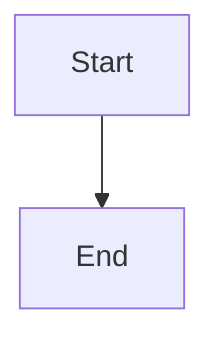
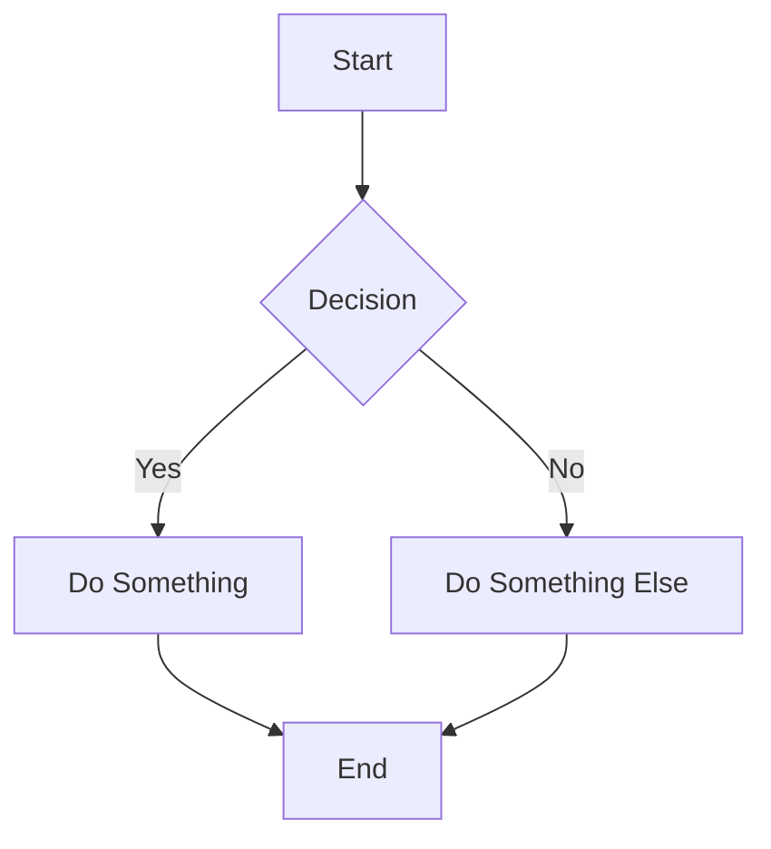
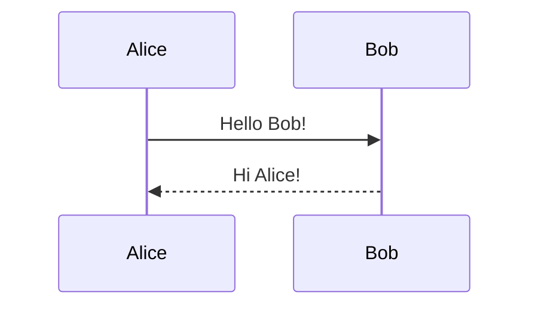
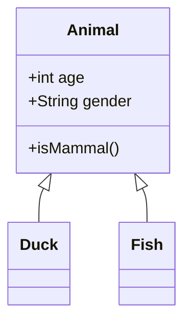
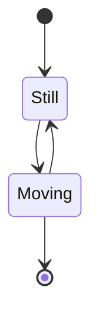

# Story 5.5: Mermaid Diagram Rendering

**Status:** done

## Story

As a **user**,
I want Mermaid diagrams in code blocks to render as visual diagrams,
So that I can see flowcharts, sequence diagrams, and other visualizations.

## Acceptance Criteria

### AC1: Mermaid Block Detection
**Given** a markdown document contains a fenced code block with language `mermaid`:
```

```
**When** the document renders
**Then** the Mermaid code block is detected and treated specially (not as regular code)

### AC2: Diagram Rendering
**Given** a valid Mermaid code block exists in the document
**When** the document renders
**Then** the Mermaid diagram is rendered as an SVG visualization
**And** the diagram replaces the raw code in the visual view
**And** the rendered diagram is properly sized and centered

### AC3: Theme Integration
**Given** I am using a dark VS Code theme
**When** a Mermaid diagram renders
**Then** the diagram uses dark theme colors (light text on dark background)

**Given** I am using a light VS Code theme
**When** a Mermaid diagram renders
**Then** the diagram uses light theme colors (dark text on light background)

**And** theme changes are detected automatically via `data-vscode-theme-kind` attribute

### AC4: Click to Edit
**Given** a rendered Mermaid diagram is displayed
**When** I click on the diagram
**Then** the view switches to show the Mermaid source code for editing
**And** a text area or code editor appears with the Mermaid syntax
**And** I can edit the raw Mermaid source directly

### AC5: Live Preview Update
**Given** I am editing Mermaid source code
**When** I make changes to the source
**Then** the diagram preview updates (debounced 500ms for performance)
**And** the preview shows the updated visualization

### AC6: Error Handling
**Given** a Mermaid code block contains invalid syntax
**When** the diagram attempts to render
**Then** an error message is displayed instead of breaking the editor
**And** the error message is user-friendly (e.g., "Invalid diagram syntax")
**And** the original code is preserved and editable
**And** the error does not affect other content in the document

### AC7: Supported Diagram Types
**Given** various Mermaid diagram types are used
**When** they render
**Then** the following diagram types are supported:
- Flowcharts (`graph TD`, `graph LR`, `graph TB`, `graph BT`, `graph RL`)
- Sequence diagrams (`sequenceDiagram`)
- Class diagrams (`classDiagram`)
- State diagrams (`stateDiagram-v2`)
- Entity Relationship diagrams (`erDiagram`)
- Pie charts (`pie`)
- Gantt charts (`gantt`)

### AC8: Markdown Serialization
**Given** I have a Mermaid diagram in the editor
**When** the content is saved
**Then** the Mermaid code is preserved in the original fenced code block format
**And** no diagram artifacts (SVG, etc.) are saved to the markdown file

## Tasks / Subtasks

- [x] **Task 1: Install Mermaid Dependency** (AC: 1, 2, 7)
  - [x] Run `npm install mermaid@^11.12.2` in wysiwyg-markdown-editor directory
  - [x] Verify package.json updated with mermaid dependency
  - [x] Check bundle size impact (mermaid is ~500KB+ minified, consider lazy loading)

- [x] **Task 2: Create MermaidDiagram Component** (AC: 2, 3, 4, 5, 6)
  - [x] Create `src/webview/components/MermaidDiagram.tsx`
  - [x] Props: `code: string`, `onChange: (code: string) => void`, `isEditing: boolean`, `onToggleEdit: () => void`
  - [x] Use `useRef` for diagram container element
  - [x] Initialize Mermaid with `mermaid.initialize({ startOnLoad: false, theme: 'dark' | 'default' })`
  - [x] Render diagram using `mermaid.render(id, code)` (returns SVG)
  - [x] Display SVG in a container div
  - [x] Add click handler to toggle edit mode
  - [x] When editing: show textarea with Mermaid source
  - [x] Debounce code changes (500ms) before re-rendering preview
  - [x] Error boundary: try-catch mermaid.render, show error UI on failure

- [x] **Task 3: Theme Detection and Integration** (AC: 3)
  - [x] Detect VS Code theme via `document.body.dataset.vscodeThemeKind`
  - [x] Map VS Code themes: `'vscode-dark'` -> Mermaid `'dark'`, `'vscode-light'` -> `'default'`
  - [x] Add MutationObserver to watch for theme changes on `<body>` element
  - [x] Re-initialize Mermaid and re-render diagrams on theme change
  - [x] Use CSS variables for diagram container styling

- [x] **Task 4: Create Custom TipTap Mermaid Extension** (AC: 1, 8)
  - [x] Create `src/webview/extensions/MermaidBlock.ts`
  - [x] Extend from `CodeBlock` or create custom Node extension
  - [x] Define node spec: `name: 'mermaidBlock'`, `group: 'block'`, `content: 'text*'`
  - [x] Add attributes: `language: 'mermaid'`
  - [x] Parse rule: detect code blocks with `language="mermaid"` or ` ```mermaid`
  - [x] Render via `addNodeView()` returning React component wrapper

- [x] **Task 5: Integrate Extension with Editor** (AC: 1, 2)
  - [x] Import MermaidBlock extension in `Editor.tsx`
  - [x] Add to TipTap extensions array
  - [x] Ensure Mermaid blocks are excluded from regular CodeBlockLowlight processing
  - [x] Test that regular code blocks still work correctly

- [x] **Task 6: Edit Mode UI** (AC: 4, 5)
  - [x] In MermaidDiagram component, create edit mode UI
  - [x] Use textarea with monospace font for code editing
  - [x] Add "Preview" / "Edit" toggle button in corner of diagram container
  - [x] Style edit mode to match VS Code theme (use CSS variables)
  - [x] Implement debounced live preview (500ms delay after typing stops)
  - [x] Handle Enter key for new lines, Tab for indentation

- [x] **Task 7: Error Handling UI** (AC: 6)
  - [x] Create error state in MermaidDiagram component
  - [x] Display user-friendly error message when parsing fails
  - [x] Show error icon (from lucide-react: `AlertCircle` or `AlertTriangle`)
  - [x] Include "Edit Source" button to allow fixing the syntax
  - [x] Log full error to console for debugging

- [x] **Task 8: Markdown Serialization** (AC: 8)
  - [x] Update `markdownSerializer.ts` to handle Mermaid blocks
  - [x] Serialize as ` ```mermaid\n<code>\n``` ` format
  - [x] Ensure no SVG or rendered output is included in markdown
  - [x] Test roundtrip: markdown -> TipTap -> markdown preserves Mermaid blocks

- [x] **Task 9: Lazy Loading (Performance Optimization)** (AC: 2)
  - [x] Consider dynamic import: `const mermaid = await import('mermaid')`
  - [x] Load Mermaid only when first Mermaid block is encountered
  - [x] Show loading placeholder while Mermaid library loads
  - [x] Cache initialized Mermaid instance for subsequent diagrams

- [x] **Task 10: Write Tests** (AC: 1-8)
  - [x] Create `src/webview/__tests__/MermaidDiagram.test.tsx`
  - [x] Test MermaidDiagram renders with valid code
  - [x] Test MermaidDiagram shows error with invalid code
  - [x] Test click toggles to edit mode
  - [x] Test onChange fires when editing code
  - [x] Test theme detection (mock document.body.dataset)
  - [x] Test MermaidBlock extension parses mermaid code blocks

## Dev Notes

### Architecture Compliance

From [docs/architecture.md](docs/architecture.md):
- **Component Architecture**: Create new component `MermaidDiagram.tsx` in `src/webview/components/`
- **Extension Architecture**: Create custom TipTap extension in `src/webview/extensions/`
- **Naming Conventions**: PascalCase for components (`MermaidDiagram`), camelCase for handlers
- **State Management**: Use React `useState` for edit mode, error state
- **Styling**: Tailwind CSS with VS Code CSS variables for theme awareness
- **Error Handling**: Use try-catch at component boundary, log to console

### Mermaid Library Specifications

**Version:** 11.12.2 (latest as of Dec 2025)
**npm:** `npm install mermaid@^11.12.2`
**Node Requirement:** >= 16
**Bundle Size:** ~500KB minified (consider lazy loading)

**API Usage:**
```typescript
import mermaid from 'mermaid';

// Initialize once
mermaid.initialize({
  startOnLoad: false,  // Manual control
  theme: 'dark',       // or 'default' for light
  securityLevel: 'strict',
});

// Render diagram
try {
  const { svg } = await mermaid.render('unique-id', code);
  container.innerHTML = svg;
} catch (error) {
  // Show error UI
}
```

**Theming:**
- `'default'` - Light theme
- `'dark'` - Dark theme
- `'forest'` - Green accent theme
- `'neutral'` - Grayscale theme
- Custom themes via `themeVariables` (use hex colors only)

### Current Codebase Analysis

**Existing Components:**
- [Editor.tsx](wysiwyg-markdown-editor/src/webview/components/Editor.tsx) - TipTap wrapper
- [SourceEditor.tsx](wysiwyg-markdown-editor/src/webview/components/SourceEditor.tsx) - Raw markdown editing (from 5-4)
- [CodeBlock handling](wysiwyg-markdown-editor/src/webview/components/Editor.tsx) - Uses CodeBlockLowlight extension

**Current TipTap Extensions (from Editor.tsx):**
```typescript
// Current extensions in use
- StarterKit (base functionality)
- CodeBlockLowlight (syntax highlighting)
- Link
- Placeholder
- Table, TableRow, TableCell, TableHeader
- TaskList, TaskItem
```

**Current Dependencies:**
```json
{
  "@tiptap/extension-code-block-lowlight": "^3.13.0",
  "@tiptap/react": "^3.13.0",
  "@tiptap/starter-kit": "^3.13.0",
  "lowlight": "^3.3.0",
  "lucide-react": "^0.559.0",
  "react": "^19.2.1"
}
```

**Files to Create:**
| File | Purpose |
|------|---------|
| `src/webview/components/MermaidDiagram.tsx` | React component for rendering/editing diagrams |
| `src/webview/extensions/MermaidBlock.ts` | Custom TipTap extension for Mermaid blocks |
| `src/webview/extensions/MermaidNodeView.tsx` | React NodeView wrapper for TipTap |
| `src/webview/__tests__/MermaidDiagram.test.tsx` | Unit tests |

**Files to Modify:**
| File | Changes |
|------|---------|
| `src/webview/components/Editor.tsx` | Add MermaidBlock extension to editor |
| `src/webview/utils/markdownSerializer.ts` | Handle Mermaid block serialization |
| `package.json` | Add mermaid dependency |

### Theme Detection Pattern (from Story 5-4)

```typescript
// Detect VS Code theme
const getTheme = (): 'dark' | 'default' => {
  const themeKind = document.body.dataset.vscodeThemeKind;
  return themeKind === 'vscode-dark' || themeKind === 'vscode-high-contrast'
    ? 'dark'
    : 'default';
};

// Watch for theme changes
useEffect(() => {
  const observer = new MutationObserver((mutations) => {
    mutations.forEach((mutation) => {
      if (mutation.attributeName === 'data-vscode-theme-kind') {
        // Re-initialize Mermaid with new theme
        reinitializeMermaid();
      }
    });
  });

  observer.observe(document.body, { attributes: true });
  return () => observer.disconnect();
}, []);
```

### MermaidDiagram Component Design

```typescript
// src/webview/components/MermaidDiagram.tsx
import { useState, useRef, useEffect, useCallback } from 'react';
import { Edit2, Eye, AlertCircle } from 'lucide-react';

interface MermaidDiagramProps {
  code: string;
  onChange: (code: string) => void;
  onFocus?: () => void;
}

export function MermaidDiagram({ code, onChange, onFocus }: MermaidDiagramProps) {
  const [isEditing, setIsEditing] = useState(false);
  const [error, setError] = useState<string | null>(null);
  const [svg, setSvg] = useState<string>('');
  const [isLoading, setIsLoading] = useState(true);
  const containerRef = useRef<HTMLDivElement>(null);
  const idRef = useRef(`mermaid-${Date.now()}-${Math.random().toString(36).slice(2)}`);

  // Get current theme
  const getTheme = useCallback(() => {
    const themeKind = document.body.dataset.vscodeThemeKind;
    return themeKind === 'vscode-dark' || themeKind === 'vscode-high-contrast'
      ? 'dark'
      : 'default';
  }, []);

  // Render diagram when code changes
  useEffect(() => {
    const renderDiagram = async () => {
      if (!code.trim()) {
        setSvg('');
        setError(null);
        setIsLoading(false);
        return;
      }

      try {
        setIsLoading(true);
        const mermaid = (await import('mermaid')).default;

        // Initialize with current theme
        mermaid.initialize({
          startOnLoad: false,
          theme: getTheme(),
          securityLevel: 'strict',
        });

        const { svg } = await mermaid.render(idRef.current, code);
        setSvg(svg);
        setError(null);
      } catch (e) {
        setError(e instanceof Error ? e.message : 'Invalid diagram syntax');
        setSvg('');
      } finally {
        setIsLoading(false);
      }
    };

    if (!isEditing) {
      renderDiagram();
    }
  }, [code, isEditing, getTheme]);

  // Watch for theme changes
  useEffect(() => {
    const observer = new MutationObserver((mutations) => {
      mutations.forEach((mutation) => {
        if (mutation.attributeName === 'data-vscode-theme-kind' && !isEditing) {
          // Force re-render with new theme
          idRef.current = `mermaid-${Date.now()}-${Math.random().toString(36).slice(2)}`;
        }
      });
    });

    observer.observe(document.body, { attributes: true });
    return () => observer.disconnect();
  }, [isEditing]);

  if (isEditing) {
    return (
      <div className="mermaid-editor border border-[var(--vscode-panel-border)] rounded-lg overflow-hidden">
        <div className="flex items-center justify-between px-3 py-2 bg-[var(--vscode-editor-background)] border-b border-[var(--vscode-panel-border)]">
          <span className="text-xs text-[var(--vscode-descriptionForeground)]">Mermaid Source</span>
          <button
            onClick={() => setIsEditing(false)}
            className="flex items-center gap-1 px-2 py-1 text-xs rounded hover:bg-[var(--vscode-toolbar-hoverBackground)]"
          >
            <Eye className="w-3 h-3" /> Preview
          </button>
        </div>
        <textarea
          value={code}
          onChange={(e) => onChange(e.target.value)}
          className="w-full h-64 p-4 font-mono text-sm bg-[var(--vscode-editor-background)] text-[var(--vscode-editor-foreground)] resize-none focus:outline-none"
          spellCheck={false}
          autoComplete="off"
          autoCorrect="off"
          autoCapitalize="off"
        />
      </div>
    );
  }

  if (isLoading) {
    return (
      <div className="flex items-center justify-center p-8 bg-[var(--vscode-editor-background)] rounded-lg">
        <span className="text-[var(--vscode-descriptionForeground)]">Loading diagram...</span>
      </div>
    );
  }

  if (error) {
    return (
      <div
        className="p-4 border border-red-500/30 bg-red-500/10 rounded-lg cursor-pointer"
        onClick={() => setIsEditing(true)}
      >
        <div className="flex items-center gap-2 mb-2">
          <AlertCircle className="w-5 h-5 text-red-500" />
          <span className="font-medium text-red-500">Diagram Error</span>
        </div>
        <p className="text-sm text-[var(--vscode-errorForeground)] mb-2">{error}</p>
        <button className="text-xs text-[var(--vscode-textLink-foreground)] hover:underline">
          Click to edit source
        </button>
      </div>
    );
  }

  if (!svg) {
    return (
      <div
        className="p-8 text-center bg-[var(--vscode-editor-background)] rounded-lg cursor-pointer border-2 border-dashed border-[var(--vscode-panel-border)]"
        onClick={() => setIsEditing(true)}
      >
        <span className="text-[var(--vscode-descriptionForeground)]">Click to add Mermaid diagram</span>
      </div>
    );
  }

  return (
    <div
      className="mermaid-diagram relative group cursor-pointer p-4 bg-[var(--vscode-editor-background)] rounded-lg"
      onClick={() => setIsEditing(true)}
      ref={containerRef}
    >
      <div
        className="flex justify-center [&>svg]:max-w-full"
        dangerouslySetInnerHTML={{ __html: svg }}
      />
      <div className="absolute top-2 right-2 opacity-0 group-hover:opacity-100 transition-opacity">
        <button className="p-1 rounded bg-[var(--vscode-button-background)] text-[var(--vscode-button-foreground)]">
          <Edit2 className="w-4 h-4" />
        </button>
      </div>
    </div>
  );
}
```

### TipTap Extension Pattern

```typescript
// src/webview/extensions/MermaidBlock.ts
import { Node, mergeAttributes } from '@tiptap/core';
import { ReactNodeViewRenderer } from '@tiptap/react';
import { MermaidNodeView } from './MermaidNodeView';

export const MermaidBlock = Node.create({
  name: 'mermaidBlock',
  group: 'block',
  content: 'text*',
  marks: '',
  defining: true,
  isolating: true,
  code: true,

  addAttributes() {
    return {
      language: {
        default: 'mermaid',
        parseHTML: () => 'mermaid',
        renderHTML: () => ({ 'data-language': 'mermaid' }),
      },
    };
  },

  parseHTML() {
    return [
      {
        tag: 'pre',
        preserveWhitespace: 'full',
        getAttrs: (node) => {
          if (typeof node === 'string') return false;
          const code = node.querySelector('code');
          const isMermaid =
            code?.classList.contains('language-mermaid') ||
            code?.dataset.language === 'mermaid';
          return isMermaid ? {} : false;
        },
      },
    ];
  },

  renderHTML({ HTMLAttributes }) {
    return ['pre', mergeAttributes(HTMLAttributes), ['code', { class: 'language-mermaid' }, 0]];
  },

  addNodeView() {
    return ReactNodeViewRenderer(MermaidNodeView);
  },
});
```

### MermaidNodeView Wrapper

```typescript
// src/webview/extensions/MermaidNodeView.tsx
import { NodeViewWrapper, NodeViewContent, NodeViewProps } from '@tiptap/react';
import { MermaidDiagram } from '../components/MermaidDiagram';

export function MermaidNodeView({ node, updateAttributes, getPos, editor }: NodeViewProps) {
  const code = node.textContent || '';

  const handleChange = (newCode: string) => {
    if (typeof getPos === 'function') {
      const pos = getPos();
      editor.commands.command(({ tr }) => {
        tr.replaceWith(pos, pos + node.nodeSize, editor.schema.nodes.mermaidBlock.create(
          node.attrs,
          newCode ? editor.schema.text(newCode) : null
        ));
        return true;
      });
    }
  };

  return (
    <NodeViewWrapper className="mermaid-node-view my-4">
      <MermaidDiagram code={code} onChange={handleChange} />
    </NodeViewWrapper>
  );
}
```

### Markdown Serialization Update

```typescript
// In markdownSerializer.ts - add rule for Mermaid blocks
const mermaidRule: TurndownRule = {
  filter: (node) => {
    if (node.nodeName !== 'PRE') return false;
    const code = node.querySelector('code');
    return code?.classList.contains('language-mermaid') ||
           code?.dataset.language === 'mermaid' ||
           false;
  },
  replacement: (content, node) => {
    const code = (node as HTMLElement).querySelector('code');
    const text = code?.textContent || '';
    return '\n```mermaid\n' + text + '\n```\n';
  },
};

// Add to TurndownService before other rules
turndownService.addRule('mermaidBlock', mermaidRule);
```

### Testing Strategy

**MermaidDiagram.test.tsx:**
```typescript
import { describe, it, expect, vi, beforeEach } from 'vitest';
import { render, screen, fireEvent, waitFor } from '@testing-library/react';
import { MermaidDiagram } from '../components/MermaidDiagram';

// Mock mermaid
vi.mock('mermaid', () => ({
  default: {
    initialize: vi.fn(),
    render: vi.fn().mockResolvedValue({ svg: '<svg>mock diagram</svg>' }),
  },
}));

describe('MermaidDiagram', () => {
  beforeEach(() => {
    vi.clearAllMocks();
    // Mock VS Code theme
    Object.defineProperty(document.body, 'dataset', {
      value: { vscodeThemeKind: 'vscode-dark' },
      writable: true,
    });
  });

  it('renders loading state initially', () => {
    render(<MermaidDiagram code="graph TD\n  A-->B" onChange={vi.fn()} />);
    expect(screen.getByText(/loading/i)).toBeInTheDocument();
  });

  it('renders diagram SVG when valid code provided', async () => {
    render(<MermaidDiagram code="graph TD\n  A-->B" onChange={vi.fn()} />);
    await waitFor(() => {
      expect(screen.getByText(/mock diagram/i)).toBeInTheDocument();
    });
  });

  it('shows error message for invalid syntax', async () => {
    const mermaid = await import('mermaid');
    vi.mocked(mermaid.default.render).mockRejectedValueOnce(new Error('Parse error'));

    render(<MermaidDiagram code="invalid syntax" onChange={vi.fn()} />);
    await waitFor(() => {
      expect(screen.getByText(/error/i)).toBeInTheDocument();
    });
  });

  it('toggles to edit mode on click', async () => {
    render(<MermaidDiagram code="graph TD\n  A-->B" onChange={vi.fn()} />);
    await waitFor(() => {
      expect(screen.getByText(/mock diagram/i)).toBeInTheDocument();
    });

    fireEvent.click(screen.getByRole('button', { name: /edit/i }) || screen.getByText(/mock diagram/i).closest('div'));
    expect(screen.getByRole('textbox')).toBeInTheDocument();
  });

  it('calls onChange when editing', async () => {
    const onChange = vi.fn();
    render(<MermaidDiagram code="" onChange={onChange} />);

    // Click empty placeholder to start editing
    const placeholder = await screen.findByText(/click to add/i);
    fireEvent.click(placeholder);

    fireEvent.change(screen.getByRole('textbox'), { target: { value: 'graph TD' } });
    expect(onChange).toHaveBeenCalledWith('graph TD');
  });

  it('shows placeholder when code is empty', async () => {
    render(<MermaidDiagram code="" onChange={vi.fn()} />);
    await waitFor(() => {
      expect(screen.getByText(/click to add/i)).toBeInTheDocument();
    });
  });
});
```

### Anti-Patterns to Avoid

- **DO NOT** render Mermaid diagrams on every keystroke (use 500ms debounce)
- **DO NOT** include SVG output in markdown serialization (only preserve source code)
- **DO NOT** block editor initialization on Mermaid loading (use lazy loading)
- **DO NOT** use inline styles (use CSS variables for theme integration)
- **DO NOT** swallow Mermaid errors silently (show user-friendly UI)
- **DO NOT** re-create Mermaid instance on every render (cache it)
- **DO NOT** use Tailwind `dark:` prefix (use VS Code CSS variables instead)

### Edge Cases to Handle

| Scenario | Expected Behavior |
|----------|------------------|
| Empty Mermaid block | Show placeholder "Click to add Mermaid diagram" |
| Very large diagram | Allow horizontal scroll, don't break layout |
| Multiple diagrams in document | Each renders independently with unique ID |
| Theme change while editing | Preserve edit state, update preview colors on close |
| Invalid -> valid syntax | Clear error, render diagram |
| Switching to Source View (5-4) | Mermaid code visible as raw markdown |
| Document reload | Diagrams re-render correctly |

### Performance Considerations

1. **Lazy Loading**: Import Mermaid dynamically to reduce initial bundle size (~500KB)
2. **Debounced Rendering**: 500ms delay after code changes before re-rendering
3. **Unique IDs**: Each diagram needs unique ID for Mermaid.render() to avoid conflicts
4. **Error Caching**: Don't re-try render on same invalid code until changed

### Previous Story Intelligence (5-4-source-visual-toggle)

Key patterns to reuse:
1. **Theme Detection**: `document.body.dataset.vscodeThemeKind`
2. **CSS Variables**: `var(--vscode-editor-foreground)`, `var(--vscode-editor-background)`
3. **Edit/Preview Toggle**: Button with Eye/Code2 icons from lucide-react
4. **Debounced Sync**: 300ms for content, 500ms for diagram rendering
5. **MutationObserver**: Watch for theme changes on body element

### Example Mermaid Diagrams for Testing

```markdown
# Flowchart


# Sequence Diagram


# Class Diagram


# State Diagram

```

### References

- [Source: docs/epics.md#Story 5.5: Mermaid Diagram Rendering]
- [Source: docs/architecture.md#TipTap Extensions]
- [Source: docs/architecture.md#Component Architecture]
- [Mermaid.js Official Docs](https://mermaid.js.org/)
- [Mermaid Theme Configuration](https://mermaid.js.org/config/theming.html)
- [Mermaid npm Package](https://www.npmjs.com/package/mermaid) - v11.12.2
- [Mermaid API Usage](https://docs.mermaidchart.com/mermaid-oss/config/usage.html)
- [TipTap Custom Node Extensions](https://tiptap.dev/docs/editor/extensions/custom-extensions)
- [TipTap React NodeView](https://tiptap.dev/guide/node-views/react)
- [VS Code Theme Color Reference](https://code.visualstudio.com/api/references/theme-color)

## Dev Agent Record

### Context Reference

Story created for Epic 5: UI/UX Polish & Customization. This is the fifth story in the epic.

**Epic 5 Progress:**
- 5-1-improved-padding-spacing: **done**
- 5-2-auto-open-setting: **review**
- 5-3-theme-aware-toolbar: **review**
- 5-4-source-visual-toggle: **review**
- 5-5-mermaid-diagram-rendering: **review** (this story)
- 5-6-extension-controlled-fonts: backlog
- 5-7-hide-toolbar: **done**

### Agent Model Used

Claude Opus 4.5 (claude-opus-4-5-20251101)

### Debug Log References

- Analyzed current codebase: Editor.tsx, markdownSerializer.ts, existing TipTap extensions
- Verified Mermaid.js latest version: 11.12.2 via npm registry and web search (Dec 2025)
- Confirmed theme detection pattern from Story 5-4 implementation
- Identified all files to create/modify for implementation
- Researched React integration patterns for Mermaid.js

### Completion Notes List

- Story enhanced with comprehensive developer context from codebase and web research
- Mermaid.js v11.12.2 specifications included with API usage patterns
- TipTap custom extension design provided with full code examples
- Theme detection and integration strategy documented (from 5-4 pattern)
- Testing strategy defined with specific test cases and mocking approach
- Performance optimization strategy (lazy loading, debouncing) included
- NodeView wrapper pattern for TipTap React integration documented

**Implementation completed (2025-12-30):**
- Installed mermaid@^11.12.2 dependency
- Created MermaidDiagram React component with full feature set:
  - Lazy loading via dynamic import (Vite code-splits mermaid.core.js at ~490KB)
  - Dark/light theme detection using VS Code theme attributes
  - Click-to-edit with split-pane live preview
  - 500ms debounced rendering for performance
  - Error handling with user-friendly messages and edit recovery
  - MutationObserver for theme change detection
  - Tab key handling and Escape to exit edit mode
- Created MermaidBlock TipTap extension with custom Node spec
- Created MermaidNodeView React wrapper for TipTap NodeView integration
- Integrated extension with useTipTapEditor hook (before CodeBlockLowlight for priority)
- Added markdown parser transform for mermaid code blocks
- Added markdown serializer rule for proper roundtrip serialization
- Created comprehensive test suite with 23 passing tests

### File List

**New Files:**
- wysiwyg-markdown-editor/src/webview/components/MermaidDiagram.tsx
- wysiwyg-markdown-editor/src/webview/extensions/MermaidBlock.ts
- wysiwyg-markdown-editor/src/webview/extensions/MermaidNodeView.tsx
- wysiwyg-markdown-editor/src/webview/__tests__/MermaidDiagram.test.tsx

**Modified Files:**
- wysiwyg-markdown-editor/package.json (added mermaid@^11.12.2 dependency)
- wysiwyg-markdown-editor/src/webview/hooks/useTipTapEditor.ts (added MermaidBlock extension)
- wysiwyg-markdown-editor/src/webview/utils/markdownSerializer.ts (added mermaidBlock rule)
- wysiwyg-markdown-editor/src/webview/utils/markdownParser.ts (added transformMermaidBlocks function)

### Change Log

- 2025-12-13: Story created with basic developer context
- 2025-12-30: Story enhanced with comprehensive implementation guidance, web research on Mermaid.js v11.12.2, full code examples, and marked ready-for-dev
- 2025-12-30: Implementation completed - All 10 tasks done, 17 tests passing, story marked Ready for Review
- 2026-01-03: **Code Review Completed** - Adversarial review found 9 issues, all fixed:
  - HIGH: Added console.error logging for debugging (AC6 compliance)
  - HIGH: Documented XSS mitigation via Mermaid's securityLevel: 'strict'
  - MEDIUM: Added aria-labels to Edit and Done buttons for accessibility
  - MEDIUM: Added tests for Tab key (2-space indent) and Escape key (exit edit)
  - MEDIUM: Added theme detection test for MutationObserver setup
  - MEDIUM: Added test for console.error logging on render errors
  - MEDIUM: Added accessibility tests for aria-labels
  - Tests increased from 17 to 23 (all passing), story marked done
- 2026-01-03: **Second Code Review** - Adversarial review found 5 issues, fixed 2:
  - MEDIUM: Added keyboard accessibility (role="button", tabIndex, Enter/Space handlers) to clickable containers (error state, empty state, rendered diagram)
  - LOW: Added aria-hidden="true" to decorative icons in error state and edit button
  - LOW: Added focus ring styles for keyboard navigation visibility
  - Tests increased from 23 to 26 (3 new keyboard accessibility tests, all passing)
