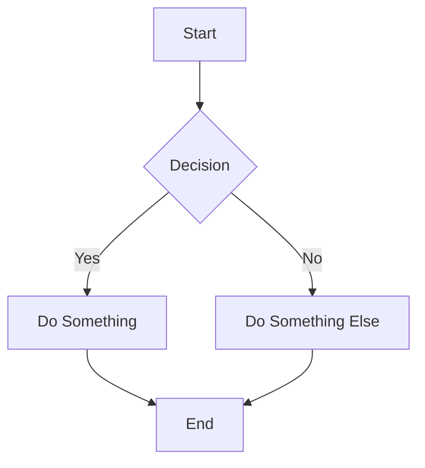

# Heading One

This is the first paragraph. It has some text to show spacing.

This is the second paragraph. The gap between this and the previous one should be clearly visible — about 1em.

This is a third paragraph. This line uses a soft break (Shift+Enter) — it should have NO extra gap, just a new line within the same paragraph.

## Heading Two

Another paragraph after a heading. The gap here should be tighter than between two paragraphs.

-   List item one
    
-   List item two
    
    -   Nested item
        

### Task Lists

- [x] Completed task
- [ ] Open task

## Table Test

| Name | Status |
| --- | --- |
| Alpha | Done |
| Beta | In Progress |

> This is a blockquote with one paragraph.
> 
> And a second paragraph inside the blockquote.

## Mermaid Diagram

